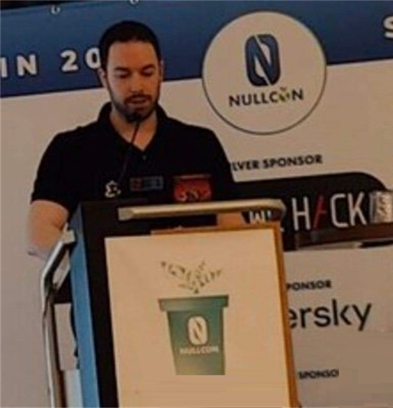

# Jonathan Bar Or ("JBO")
Security Researcher, Microsoft  
[Twitter](https://twitter.com/yo_yo_yo_jbo), [Github](https://github.com/yo-yo-yo-jbo), [LinkedIn](https://www.linkedin.com/in/jonathan-bar-or-89876474/)

## Publications and speaking
- ⚔️ Offensive security publications
    - [Android apps with millions of downloads exposed to high-severity vulnerabilities](https://www.microsoft.com/en-us/security/blog/2022/05/27/android-apps-with-millions-of-downloads-exposed-to-high-severity-vulnerabilities/)
    - [Gatekeeper’s Achilles heel: Unearthing a macOS vulnerability](https://www.microsoft.com/en-us/security/blog/2022/12/19/gatekeepers-achilles-heel-unearthing-a-macos-vulnerability/)
    - [Microsoft finds new NETGEAR firmware vulnerabilities that could lead to identity theft and full system compromise](https://www.microsoft.com/en-us/security/blog/2021/06/30/microsoft-finds-new-netgear-firmware-vulnerabilities-that-could-lead-to-identity-theft-and-full-system-compromise/)
    - [Microsoft finds new elevation of privilege Linux vulnerability, Nimbuspwn](https://www.microsoft.com/en-us/security/blog/2022/04/26/microsoft-finds-new-elevation-of-privilege-linux-vulnerability-nimbuspwn/)
    - [Microsoft finds new macOS vulnerability, Shrootless, that could bypass System Integrity Protection](https://www.microsoft.com/en-us/security/blog/2021/10/28/microsoft-finds-new-macos-vulnerability-shrootless-that-could-bypass-system-integrity-protection/)
    - [New macOS vulnerability, Migraine, could bypass System Integrity Protection](https://www.microsoft.com/en-us/security/blog/2023/05/30/new-macos-vulnerability-migraine-could-bypass-system-integrity-protection/)
    - [New macOS vulnerability, “powerdir,” could lead to unauthorized user data access](https://www.microsoft.com/en-us/security/blog/2022/01/10/new-macos-vulnerability-powerdir-could-lead-to-unauthorized-user-data-access/)
    - [Uncovering a ChromeOS remote memory corruption vulnerability](https://www.microsoft.com/security/blog/2022/08/19/uncovering-a-chromeos-remote-memory-corruption-vulnerability/)
    - [Uncovering a macOS App Sandbox escape vulnerability: A deep dive into CVE-2022-26706](https://www.microsoft.com/security/blog/2022/07/13/uncovering-a-macos-app-sandbox-escape-vulnerability-a-deep-dive-into-cve-2022-26706/)
    - [Uncursing the ncurses: Memory corruption vulnerabilities found in library](https://www.microsoft.com/en-us/security/blog/2023/09/14/uncursing-the-ncurses-memory-corruption-vulnerabilities-found-in-library/)
- 🛡️ Defensive security publications
    - [Blue teams helping red teams: A tale of a process crash, PowerShell, and the MITRE ATT&CK evaluation](https://www.microsoft.com/en-us/security/blog/2020/06/11/blue-teams-helping-red-teams-a-tale-of-a-process-crash-powershell-and-the-mitre-attck-evaluation/)
    - [DynoRoot (CVE-2018-1111) exposed via Advanced Hunting](https://techcommunity.microsoft.com/t5/microsoft-defender-for-endpoint/dynoroot-cve-2018-1111-exposed-via-advanced-hunting/ba-p/202568)
    - [Guidance for preventing, detecting, and hunting for exploitation of the Log4j 2 vulnerability](https://www.microsoft.com/en-us/security/blog/2021/12/11/guidance-for-preventing-detecting-and-hunting-for-cve-2021-44228-log4j-2-exploitation/)
    - [Hunting down Dofoil with Windows Defender ATP](https://www.microsoft.com/en-us/security/blog/2018/04/04/hunting-down-dofoil-with-windows-defender-atp/)
    - [Inside Microsoft 365 Defender: Attack modeling for finding and stopping lateral movement](https://www.microsoft.com/en-us/security/blog/2020/06/10/the-science-behind-microsoft-threat-protection-attack-modeling-for-finding-and-stopping-evasive-ransomware/)
    - [Living-Off-The-Land Command Detection Using Active Learning](https://www.microsoft.com/en-us/research/publication/living-off-the-land-command-detection-using-active-learning/)
    - [Rise in XorDdos: A deeper look at the stealthy DDoS malware targeting Linux devices](https://www.microsoft.com/en-us/security/blog/2022/05/19/rise-in-xorddos-a-deeper-look-at-the-stealthy-ddos-malware-targeting-linux-devices/)
- 🎤 Conferences and public speaking
    - [DCGVR - A Very Dangerous Dave](https://youtu.be/n0n8PmKdbLo?si=0YV2auJ-jmI6Udu4)
    - [SANS - Windows Defender ATPs Advanced Hunting: Using Flexible Queries to Hunt Across Your Endpoints](https://www.sans.org/webcasts/windows-defender-atps-advanced-hunting-flexible-queries-hunt-endpoints-108005/)
    - [Security Unlocked - Discovering Router Vulnerabilities with Anomaly Detection](https://thecyberwire.com/podcasts/security-unlocked/37/transcript)
    - [Nullcon Berlin 2023 - The Achilles heel of the macOS Gatekeeper](https://youtu.be/dBIyjQH6E-c)
    - [Nullcon - macOS Security Features Bypasses by Example](https://nullcon.net/webinardetail/macOS-security-features-bypasses-by-example)
    - B-sides Vancouver 2024 - The Sand Castle - the state of macOS sandbox escapes through the lens of Microsoft Office (not recorded)
    - [AVAR 2022 - Security mechanisms on macOS and bypassing them](https://register.gotowebinar.com/register/4053212602586242061)
    - [DEFCON 30 VR groups - Free phone got me critical vulns affecting millions Android](https://www.youtube.com/watch?v=Ua_5qwcPgps)
    - [BlueHat IL 2022 - Learning macOS Security by Finding Vulns](https://www.youtube.com/watch?v=jBvE0kciSx8)
    - [DEFCON VR groups - The anatomy of UAC bypasses](https://www.youtube.com/watch?v=gvJ12U80q8g)
    - Thotcon 0xC - The Achilles heel of the macOS Gatekeeper (not recorded)
    - Exploitcon 2023 (Bellvue) - The curse of ncurses (not recorded)
    - [DEFCON 31 VR village - The curse of ncurses](https://youtu.be/uqWKWdW8xdk?si=1Pj4ZrtvBDR89Mo0)
    - [DEFCON 31 - Getting a Migraine](https://www.youtube.com/watch?v=zxZesAN-TEk)
    - [DEFCON 32 VR village - The Sand Castle - the state of macOS sandbox escapes through the lens of Microsoft Office ](https://media.defcon.org/DEF%20CON%2031/DEF%20CON%2031%20video%20and%20slides/Getting%20a%20Migraine%20-%20uncovering%20a%20unique%20SIP%20bypass%20on%20macOS%20-%20Jonathan%20Bar%20Or%2C%20Michael%20Pearse%2C%20and%20Anurag%20Bohra.mp4)
    - [On Path Podcast - My Professional Journey](https://open.spotify.com/episode/3x4SuG9wItoIyj1bXtVa2H)
## Writeups
- 🍎 Apple macOS
    - [Introduction to macOS - TCC](https://github.com/yo-yo-yo-jbo/macos_tcc/)
    - [Introduction to macOS - App structure](https://github.com/yo-yo-yo-jbo/macos_app_structure/)
    - [Introduction to macOS - The Gatekeeper](https://github.com/yo-yo-yo-jbo/macos_gatekeeper/)
    - [Introduction to macOS - The sandbox](https://github.com/yo-yo-yo-jbo/macos_sandbox/)
    - [Introduction to macOS - SIP](https://github.com/yo-yo-yo-jbo/macos_sip/)
    - [Introduction to macOS - Mach Ports](https://github.com/yo-yo-yo-jbo/macos_mach_ports/)
- 🪟 Microsoft Windows (and some DOS)
    - [MBR payload analysis](https://github.com/yo-yo-yo-jbo/mbr_analysis/)
    - [Introduction to anti-debugging](https://github.com/yo-yo-yo-jbo/anti_debugging_intro/)
    - [Introduction to Windows injection and hooking](https://github.com/yo-yo-yo-jbo/injection_and_hooking_intro/)
    - [Metasploit Shellcode analysis](https://github.com/yo-yo-yo-jbo/msf_shellcode_analysis/)
    - [Coding a ransomware in a minute](https://github.com/yo-yo-yo-jbo/ransomware_in_a_minute/)
    - [Virtual Memory and KnownDlls](https://github.com/yo-yo-yo-jbo/virtual_memory_known_dlls)
    - [UAC bypasses](https://github.com/yo-yo-yo-jbo/uac_bypasses/)
    - [Reverse-engineering Dangerous Dave](https://github.com/yo-yo-yo-jbo/dangerous_dave/)
    - [Binary Golf 4 - COM files](https://github.com/yo-yo-yo-jbo/binary_golf_com/)
    - [Hotkey-based keylogger for Windows](https://github.com/yo-yo-yo-jbo/hotkeyz/)
- 🐧 Linux (and some binary editing)
    - [Coding a Linux userland rootkit](https://github.com/yo-yo-yo-jbo/linux_userland_rootkit/)
    - [Binary Golf 5 - Linux shellcoding ideas](https://github.com/yo-yo-yo-jbo/bggp5_linux_shellcode/)
    - [Binary Golf 5 - Java class format](https://github.com/yo-yo-yo-jbo/bggp5_java_editing/)
    - [Introduction to Linux pwn - the beginning](https://github.com/yo-yo-yo-jbo/linux_pwn_intro/)
    - [Introduction to Linux pwn - overriding the return address](https://github.com/yo-yo-yo-jbo/linux_pwn_ret/)
- 📚 Cryptography and math
    - [Introduction to cryptography - terminology and first examples](https://github.com/yo-yo-yo-jbo/crypto_terminology/)
    - [Introduction to cryptography - basic modular arithmetics](https://github.com/yo-yo-yo-jbo/crypto_modular/)
    - [Introduction to cryptography - Vigenère cipher](https://github.com/yo-yo-yo-jbo/crypto_vigenere/)
    - [Introduction to cryptography - RSA](https://github.com/yo-yo-yo-jbo/rsa_math/)
    - [Introduction to cryptography - prime number generation](https://github.com/yo-yo-yo-jbo/generating_random_primes/)
- 👊 The Goonies CTF
    - [ångstrom CTF 2021 - Oracle of Blair](https://thegoonies.github.io/2021/04/08/angstrom-ctf-2021-oracle-of-blair/)
    - [ångstrom CTF 2021 - substitution](https://thegoonies.github.io/2021/04/07/angstromctf-2021-substitution/)
    - [ångstrom CTF 2021 - I'm so random](https://thegoonies.github.io/2021/04/07/angstromctf-2021-im_so_random/)
    - [UMass CTF 2021 - malware](https://thegoonies.github.io/2021/03/28/umass-ctf-2021-malware/)
    - [Securinets CTF Quals 2021 - MiTM](https://thegoonies.github.io/2021/03/21/securinetctf-2021-mitm/)
    - [Union CTF 2021 - Human server](https://thegoonies.github.io/2021/02/21/unionctf-2021-human-server/)
    - [justCTF 2020 - That's not crypto](https://thegoonies.github.io/2021/01/31/justctf-2020-thats-not-crypto/)
    - [CrowdStrike CTF 2021 - Module Wow](https://thegoonies.github.io/2021/01/29/crowstrike-ctf-2021-module-wow/)
    - [CrowdStrike CTF 2021 - Matrix](https://thegoonies.github.io/2021/01/29/crowstrike-ctf-2021-matrix/)
## Others
- 🎉 CVEs
    - [CVE-2024-44133 - macOS TCC bypass](https://cve.mitre.org/cgi-bin/cvename.cgi?name=CVE-2024-44133)
    - [CVE-2023-32369 - macOS SIP bypass](https://cve.mitre.org/cgi-bin/cvename.cgi?name=CVE-2023-32369)
    - [CVE-2023-29491 - Multiple memory corruption vulnerabilities in the ncurses library](https://cve.mitre.org/cgi-bin/cvename.cgi?name=CVE-2023-29491)
    - [CVE-2022-4499 - Cryptographic side-channel attack on TP-link routers httpd authentication method](https://cve.mitre.org/cgi-bin/cvename.cgi?name=CVE-2022-4499)
    - [CVE-2022-4498 - Buffer overflow in TP-link routers httpd](https://cve.mitre.org/cgi-bin/cvename.cgi?name=CVE-2022-4498)
    - [CVE-2022-42821 - macOS Gatekeeper bypass](https://cve.mitre.org/cgi-bin/cvename.cgi?name=CVE-2022-42821)
    - [CVE-2022-29800 - Linux networkd-dispatcher race condition (TOCTOU)](https://cve.mitre.org/cgi-bin/cvename.cgi?name=CVE-2022-29800)
    - [CVE-2022-29799 - Linux networkd-dispatcher directory traversal](https://cve.mitre.org/cgi-bin/cvename.cgi?name=CVE-2022-29799)
    - [CVE-2022-26706 - macOS sandbox escape](https://cve.mitre.org/cgi-bin/cvename.cgi?name=CVE-2022-26706)
    - [CVE-2022-2587 - ChromeOS remote memory corruption vulnerability](https://cve.mitre.org/cgi-bin/cvename.cgi?name=CVE-2022-2587)
    - [CVE-2022-0987 - Linux Packagekit Information Disclosure](https://cve.mitre.org/cgi-bin/cvename.cgi?name=CVE-2022-0987)
    - [CVE-2021-42601 - Android mce SDK vulnerability](https://cve.mitre.org/cgi-bin/cvename.cgi?name=CVE-2021-42601)
    - [CVE-2021-42600 - Android mce SDK vulnerability](https://cve.mitre.org/cgi-bin/cvename.cgi?name=CVE-2021-42600)
    - [CVE-2021-42599 - Android mce SDK vulnerability](https://cve.mitre.org/cgi-bin/cvename.cgi?name=CVE-2021-42599)
    - [CVE-2021-42598 - Android mce SDK vulnerability](https://cve.mitre.org/cgi-bin/cvename.cgi?name=CVE-2021-42598)
    - [CVE-2021-35247 - SolarWinds Serv-U LDAP Injection](https://cve.mitre.org/cgi-bin/cvename.cgi?name=CVE-2021-35247)
    - [CVE-2021-30970 - macOS TCC bypass](https://cve.mitre.org/cgi-bin/cvename.cgi?name=CVE-2021-30970)
    - [CVE-2021-30892 - macOS SIP bypass](https://cve.mitre.org/cgi-bin/cvename.cgi?name=CVE-2021-30892)
    - [CVE-2020-35785 - NETGEAR DGN2200v1 authentication bypass](https://nvd.nist.gov/vuln/detail/CVE-2020-35785)
    - [CVE-2017-0095 - Hyper-V vSMB Remote Code Execution](https://cve.mitre.org/cgi-bin/cvename.cgi?name=CVE-2017-0095)
- 💡 Patents
    - Patent 408978-US-NP - Dysfunctional device detection tool
    - Patent 410415-US-NP - Command classification using active learning
    - Patent 412482-US-NP - Detecting a spoofed entity based on complexity of a distribution of events initiated by the spoofed entity
- 🚧 Other projects
    - [Cicada Tools](https://github.com/yo-yo-yo-jbo/cicada_tools) - A Cicada 3301 research utility.
    - [Hotkeyz](https://github.com/yo-yo-yo-jbo/hotkeyz) - Windows based keylogging capability using hotkeys.
    - [HM-surf evaluator](https://github.com/yo-yo-yo-jbo/hm-surf) - An evaluator for CVE-2024-44133 for all common macOS browsers.
